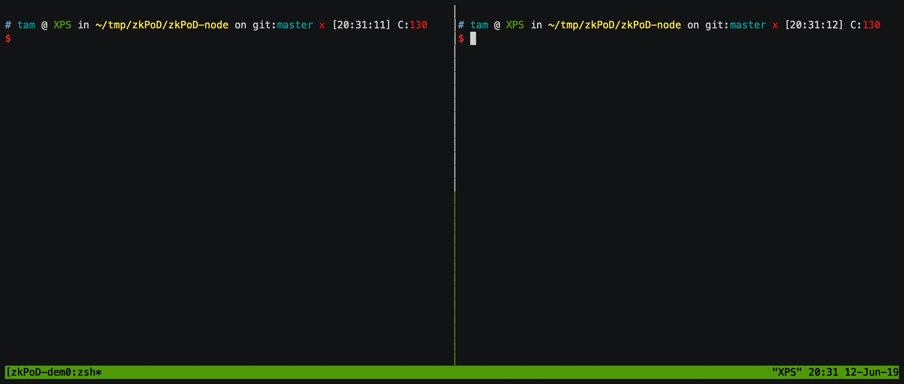
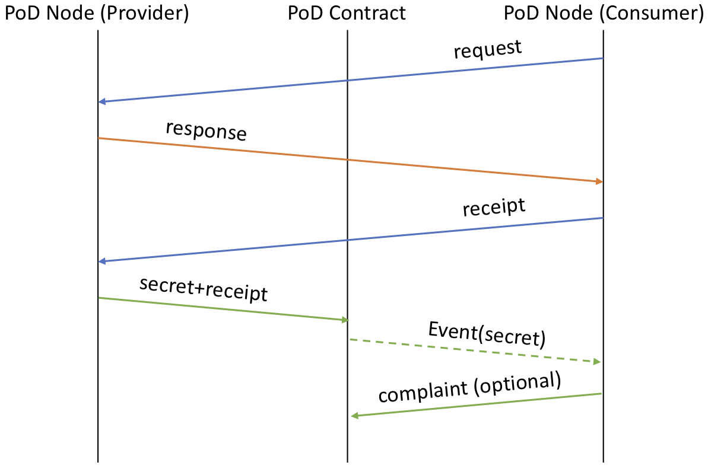
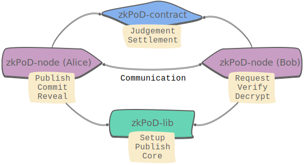
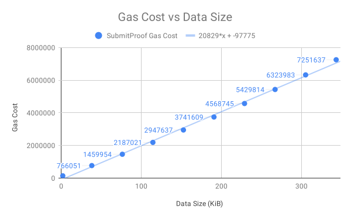
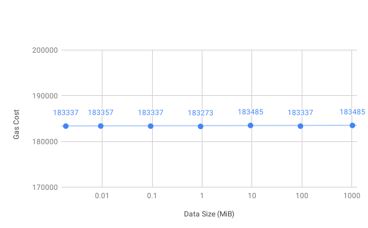

[](#contributors)
# zkPoD: A decentralized system for data exchange

**Available in [ [English](README.md) | [中文](README.zh.md) ]**

## Overview

zkPoD is a decentralized platform for data exchange between *untrusted parties* realizing "Payment on Delivery" without any *trusted third party*. Instead, zkPoD uses blockchain (e.g., Ethereum) as a *trustless third party* to ensure fairness that no party can cheat during data exchange. Moreover, zkPoD is concerned with users' privacy, hiding the intention of users to either blockchain miners or other parties. Any seller can publish data for:

- ***Data Downloading***: Buyers may pay-and-download a data file from a data seller. zkPoD supports data fragments downloading, i.e., buyers may download specific data chunks in one batched transaction. 

- ***Data Query***:  zkPoD supports structured data; e.g., the seller organizes data as tables. Multiple columns can be selected as indexed-columns, such that users may pay-and-query records in the table with one or more keywords, and get the records matched. zkPoD ensures that the query results are trustworthy, i.e. (i) if data seller replies with n records, it is impossible that more records are matching that keyword in the table; (ii) these n records are precisely in the table, and any forged records cannot be allowed. 

The three main issues being tackled by zkPoD are

+ The data is precisely what the buyer wants before payment,
+ The data must be delivered when the buyer pays,
+ The data won't be leaked before being paid.

A cryptographic protocol, PoD (proof of delivery), is developed to try to solve the issues, ensuring **fairness** between data buyers and sellers. The protocol is zero-knowledge and provable secure (*ongoing work*). See our [technical paper](https://sec-bit.github.io/zkPoD-node/paper.pdf) for more information. 

zkPoD is practical and efficient. It supports data to size up to 10GB on an ordinary PC (in complaint mode), and it could deliver data with TBs (ongoing work) in theory. See the performance evaluation below.

[](https://asciinema.org/a/251240?autoplay=1&speed=2.71828182846)

## Highlights 

+ Decentralization:  zkPoD uses smart contracts on Ethereum as the trustless third party. In theory, zkPoD can be deployed on any blockchains with basic smart contract support. The gas cost in transactions of data exchange is moderate, and the size of data can be up to TBs.
+ Atomic-swap:  zkPoD supports atomic-swap (as in [ZKCP](https://en.bitcoin.it/wiki/Zero_Knowledge_Contingent_Payment)).
+ Large data file support.  zkPoD supports delivering large data file within one transaction in complaint mode. See performance evaluation
+ Data query by keywords:  zkPoD supports pay-and-query. Before locating the records interested, a buyer may query for one or more keywords 
+ Privacy protection: The request of a buyer may be sensitive under some circumstances, the buyer can obfuscate her real intention by adding a few unrelated requests. Then the seller has to respond to all requests without knowing which one is real from the buyer, but she does know that only one response can be visible to the buyer since the buyer only paid for one request. 
+ Inspection of goods:  zkPoD supports the inspection of goods for a buyer at
  any scale natively. The buyer can randomly select any piece of data at any
  location and takes it as a sample to check whether it is something she wants
  or not. Then, the buyer can continue to buy a large amount of data after a
  satisfied inspection. zkPoD does not set a limit for the number of times a
  buyer could request for inspection. zkPoD also ensures that every piece of
  data in every inspection coming from the same data set, including the final
  batch purchase.

## Workflow and how it works

We briefly describe the workflow of transactions on zkPoD by a simplified version of the PoD protocol. 

TODO: re-draw this diagram.




#### data initialization

Data must be processed before being sold. Alice needs to compute the authenticators of data and the Merkle root of them. Authenticators are for data contents and origin verification (even if the data were encrypted). zkPoD supports two modes: plain mode and table mode. 

+ plain mode
+ table mode (CSV files)

For tabulated data, each row is a record with fixed columns. The buyer may send queries with keywords. Note that the columns must be specified before data initialization to supports keywords.

#### Data transaction

For data delivery, zkPoD supports two trading mode.

+ Atomic-swap mode

1. Bob sends request w.r.t. a data tag
2. Alice sends encrypted data to Bob (by a one-time random key)
3. Bob verifies the *encrypted* data with tag by using ZKP.
4. Bob accepts the data and submits a receipt to the contract (blockchain).
5. Alice checks the receipt and then reveals the key (for encrypting the data)
6. Contract (blockchain) verifies if the key matches the receipt and output "accept"/"reject."

+ Complaint mode (inspired by Fairswap)

1. Bob sends request w.r.t. a data tag
2. Alice sends encrypted data to Bob (by a one-time random key)
3. Bob verifies the *encrypted* data with tag by using ZKP.
4. Bob accepts the data and submits a receipt to the contract(blockchain).
5. Alice checks the receipt and then reveals the key (for encrypting the data)
6. Bob decrypts the data by the key and submits proof of misbehavior to the contract(blockchain) if he finds that Alice was cheating.

### Theories behind

For fairness and security, the protocol ensures the following requirements:
{1}. Contract (blockchain) cannot learn anything about the data, or encrypted data
{2}. Bob must submit a correct receipt to get the real key
{3}. Bob must pay before obtaining the key
{4}. Bob cannot learn anything from the encrypted data 
{5}. Alice cannot reveal a fake key, which would be ruled out by the verification algorithm of contract(blockchain)
{6}. Alice cannot send junk data to Bob, who cannot cheat when verifying data tag.

To ensure **{1, 4, 6}**, we use ZKP based on Pedersen commitments (which is additively homomorphic) with one-time-pad encryption, allowing buyers to verify the data without the help of others. A smart contract is used to exchange crypto coins with keys to ensure **{2, 3, 5}** in the way of transparent, predictable and formally verified (*ongoing work*).

We use *verifiable random function*, VRF, to support queries with keywords. Currently, zkPoD only supports exact keyword matching. zkPoD adopts *oblivious transfer*, OT, to support privacy-preserving queries.

## Play With It

### Build

*WIP: A building script for all of these steps*

#### 1. Build zkPoD-lib

Dependencies of zkPoD-lib could be found [here](https://github.com/sec-bit/zkPoD-lib#dependencies). Make sure you install them first.

```shell
# Download zkPoD-lib code
mkdir zkPoD && cd zkPoD
git clone https://github.com/sec-bit/zkPoD-lib.git

# Pull libsnark submodule
cd zkPoD-lib
git submodule init && git submodule update
cd depends/libsnark
git submodule init && git submodule update

# Build libsnark
mkdir build && cd build
# - On Ubuntu
cmake -DCMAKE_INSTALL_PREFIX=../../install -DMULTICORE=ON -DWITH_PROCPS=OFF -DWITH_SUPERCOP=OFF -DCURVE=MCL_BN128 ..
# - Or for macOS (see https://github.com/scipr-lab/libsnark/issues/99#issuecomment-367677834)
CPPFLAGS=-I/usr/local/opt/openssl/include LDFLAGS=-L/usr/local/opt/openssl/lib PKG_CONFIG_PATH=/usr/local/opt/openssl/lib/pkgconfig cmake -DCMAKE_INSTALL_PREFIX=../../install -DMULTICORE=OFF -DWITH_PROCPS=OFF -DWITH_SUPERCOP=OFF -DCURVE=MCL_BN128 ..
make && make install

# Build zkPoD-lib
cd ../../..
make

# These files should be generated after successful build.
# pod_setup/pod_setup
# pod_publish/pod_publish
# pod_core/libpod_core.so
# pod_core/pod_core

cd pod_go
export GO111MODULE=on
make test
```

#### 2. Build zkPoD-node

```shell
cd zkPoD
git clone https://github.com/sec-bit/zkPoD-node.git
cd zkPoD-node
export GO111MODULE=on
make
```

### Have Fun

#### 1. Setup

We need a [trusted setup](https://z.cash/technology/paramgen/) to generate zkPoD zkSNARK parameters.

For convenience and testing purpose, we could download it from [zkPoD-params](https://github.com/sec-bit/zkPoD-params) repo.

```shell
cd zkPoD-node
mkdir -p key/zksnark_key
cd key/zksnark_key
# Download zkSNARK pub params, see https://github.com/sec-bit/zkPoD-params
wget https://raw.githubusercontent.com/sec-bit/zkPoD-params/master/zksnark_key/atomic_swap_vc.pk
wget https://raw.githubusercontent.com/sec-bit/zkPoD-params/master/zksnark_key/atomic_swap_vc.vk
```

#### 2. Run node

```shell
cd zkPoD-node
make run
# A config file named basic.json is generated on local
```
> Examples: [`basic.json`](examples/basic.json) - Some basic configs of zkPoD-node program.

Tips: 

You should specify `LD_LIBRARY_PATH` for `libpod_core` when excuting `zkPoD-node` on Linux. On macOS you should use `DYLD_LIBRARY_PATH` instead. Check `Makefile` for examples. For convenience, you could set `LD_LIBRARY_PATH` as an environment variable.

```shell
# On Linux
export LD_LIBRARY_PATH=<YOUR_PATH_TO_LIBPOD_CORE>

# Or on macOS
export DYLD_LIBRARY_PATH=<YOUR_PATH_TO_LIBPOD_CORE>
```

#### 3. Save keystore & get some ETH

- https://faucet.ropsten.be/
- https://faucet.metamask.io/

Tips: A new Ethereum account is generated after first boot of zkPoD-node. You could read it from terminal screen or keystore file. Keep your keystore safe. You must have some ETH balance in your Ethereum address for smart contract interaction. Get some for test from a ropsten Ethereum faucet.

#### 4. As a seller: init data & publish 

Open a new terminal

```shell
cd zkPoD-node
cp ../zkPoD-lib/pod_publish/pod_publish .

wget -O test.txt https://www.gutenberg.org/files/11/11-0.txt

./zkPoD-node -o initdata -init init.json
# You should get the sigma_mkl_root from logs
# export sigma_mkl_root=<YOUR_SIGMA_MKL_ROOT>
./zkPoD-node -o publish -mkl $sigma_mkl_root -eth 200
# You should get the publish transaction hash
```
> Examples: [init.json](examples/init.json) - Use this to describe your data for sell.

Tips: For test, you could use same Ethereum account for selling and buying. You could also host a zkPoD-node and publish your data description to the [community](https://discord.gg/tfUH886) for trade testing.

Here is everything that you need to let others know.

```
- Your IP address
- Your ETH address
- Data sigma_mkl_root for trade
- Data description
- Data bulletin file
- Data public info 
```

You could get `bulletin` and `public info` of your data for publishing in path `zkPoD-node/seller/publish/$sigma_mkl_root/`.

```
├── bulletin
├── extra.json
├── private
│   ├── matrix
│   └── original
├── public
│   ├── sigma
│   └── sigma_mkl_tree
└── test.txt
```

#### 5. As a buyer: deposit to contract

You want to buy some data you interested in from a seller. You could deposit some ETH to *zkPoD exchange contract* first. Your money is still yours before you get the data you want.

```shell
./zkPoD-node -o deposit -eth 20000 -addr $SELLER_ETH_ADDR
# You should get the deposit transaction hash
```

#### 6. As a buyer: purchase data

You'll make a purchase request to a seller. For convenience, you could fill in some basic info of the seller in the config file.

```shell
# For test, you could simply copy public info of data from seller folder to project root path.
# cp seller/publish/$sigma_mkl_root/bulletin .
# cp -r seller/publish/$sigma_mkl_root/public .
./zkPoD-node -o purchase -c config.json
# You should get the decrypted data in buyer/transaction/<session_id> folder
```
> Examples: [config.json](examples/config.json) - Use this to describe data you are going to buy.

Tips:
1. Atomic-swap mode only supports up to about 340 KiB on the Ethereum network for the moment.

2. If complaint mode is selected, zkPoD-node complains to the contract automatically with proof proving that the seller is dishonest. As a result, a dishonest seller would never profit from misbehavior.

TODO: Add more examples about a query or private query of table data, and other operations.

## Project Structure

### Overview



- [zkPoD-node](https://github.com/sec-bit/zkPoD-node) Node application written in Golang for sellers (Alice) and buyers (Bob). It deals with communication, smart contract calling, data transferring, and other zkPoD protocol interactions.
- [zkPoD-lib](https://github.com/sec-bit/zkPoD-lib) zkPoD core library written in C++ shipping with Golang bindings.
- [zkPoD-contract](https://github.com/sec-bit/zkPoD-contract) Smart contracts for zkPoD *Decentralized Exchange*.

## Performance

#### Test Environment

- OS: Ubuntu 16.04.6 LTS x86_64
- CPU Model: Intel(R) Core(TM) i7-8700K CPU @ 3.70GHz
- CPU Thread Count: 12
- Memory: 32605840 kB

#### Basic Info

We present three variant protocols, PoD-AS, PoD-AS* and PoD-CR, used for different purposes.

|  Protocol  | Throughput |   Communication   |   Gas Cost (Ethereum)   | Data/Tx (Ethereum) |
| :----: | :----------------: | :---------------------: | :---------------------: | :---------------------: |
| PoD-CR |        3.39 MiB/s       |        $O(2n)$        | $O(\log{}n)$ |         < 100 TiB         |
| PoD-AS |        3.91 MiB/s       |    $O(2n)$    |    $O(n)$    |        < 350 KiB        |
| PoD-AS* |    35 KiB/s    |    $O(2n)$    |    $O(1)$    |        Unlimited        |

PoD-AS supports fastest data delivery with O(n) on-chain computation. The variant is suitable for permissioned blockchain, where the performance (TPS) is high and computation cost of smart contract is pretty low.

PoD-AS* is using zkSNARKs to reduce on-chain computation to O(1), but with slower off-chain delivery.

PoD-CR supports fast data delivery and small on-chain computation O(log(n)).

#### Benchmark Results

- Data size: 1024 MiB
- File type: plain
- s: 64
- omp_thread_num: 12

|      Protocol      | Prover (s) | Verifier (s) | Decrypt (s) | Communication Traffic (MiB) | Gas Cost |
| :------------: | :--------: | :----------: | :---------: | :-------------------------: | :------: |
| PoD-CR |    124     |     119      |     82      |            2215             | 159,072  |
|  PoD-AS   |    130     |     131      |    4.187    |            2215             |   `*`    |
|  PoD-AS*   |    34540     |     344      |    498    |            2226             |   183,485   |


`*` PoD-AS protocol does not support 1 GiB file on Ethereum network at present.

#### Gas Cost on Ethereum

PoD-CR Protocol            |  PoD-AS Protocol      |  PoD-AS* Protocol
:-------------------------:|:-------------------------:|:-------------------------:
  |  |  

## Learn more?

+ White paper: an overview introduction of the zkPoD system.
+ [Technical paper](https://sec-bit.github.io/zkPoD-node/paper.pdf): a document with theoretic details to those who are interested in the theory we are developing.
+ Community: join us on [*Discord*](https://discord.gg/tfUH886) and follow us on [*Twitter*](https://twitter.com/SECBIT_IO) please!

## Related projects

+ Fairswap:  https://github.com/lEthDev/FairSwap
+ ZKCP: https://en.bitcoin.it/wiki/Zero_Knowledge_Contingent_Payment
+ Paypub: https://github.com/unsystem/paypub

## Contributors ✨

Thanks goes to these wonderful people ([emoji key](https://allcontributors.org/docs/en/emoji-key)):

<!-- ALL-CONTRIBUTORS-LIST:START - Do not remove or modify this section -->
<!-- prettier-ignore -->
<table>
  <tr>
    <td align="center"><a href="https://github.com/huyuguang"><br /><sub><b>Hu Yuguang</b></sub></a><br /><a href="https://github.com/sec-bit/zkPoD-node/commits?author=huyuguang" title="Code">💻</a> <a href="#ideas-huyuguang" title="Ideas, Planning, & Feedback">🤔</a> <a href="https://github.com/sec-bit/zkPoD-node/commits?author=huyuguang" title="Documentation">📖</a></td>
    <td align="center"><a href="https://github.com/x0y1"><br /><sub><b>polymorphism</b></sub></a><br /><a href="https://github.com/sec-bit/zkPoD-node/commits?author=x0y1" title="Code">💻</a> <a href="#ideas-x0y1" title="Ideas, Planning, & Feedback">🤔</a> <a href="https://github.com/sec-bit/zkPoD-node/commits?author=x0y1" title="Documentation">📖</a></td>
  </tr>
</table>

<!-- ALL-CONTRIBUTORS-LIST:END -->

This project follows the [all-contributors](https://github.com/all-contributors/all-contributors) specification. Contributions of any kind welcome!